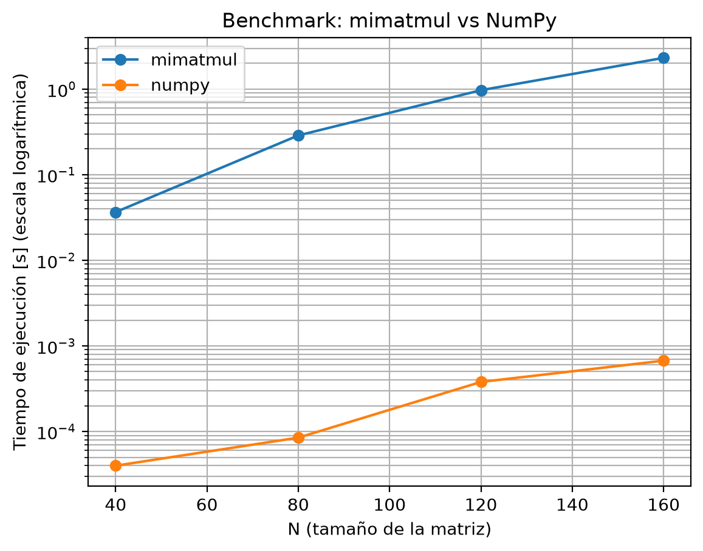

# P0-fernandez-magdalena

Proyecto 0 MCOC

## Propósito general

El Proyecto 0 busca poner en práctica los conceptos básicos del curso de
Métodos Computacionales (MCOC) mediante un proyecto incremental. Se configura
un ambiente reproducible en Python, se obtiene información real del
computador y se implementa y prueba una multiplicación de matrices sencilla,
comparándola con la implementación de NumPy.

## Reproducir el proyecto en Windows

Clonar el repositorio:

```powershell
git clone https://github.com/magdalenafr-uandes/P0-fernandez-magdalena.git
```

Entrar a la carpeta:

```powershell
cd P0-fernandez-magdalena
```

Crear el ambiente virtual:

```powershell
python -m venv .venv
```

Activar el ambiente virtual:

```powershell
.\.venv\Scripts\Activate.ps1
```

Instalar las dependencias:

```powershell
python -m pip install -r requirements.txt
```

Ejecutar las pruebas:

```powershell
python -m pytest
```

Obtener la información del computador:

```powershell
python src/system_info.py
```

Ejecutar el benchmark (mide tiempos y genera el gráfico):

```powershell
python src/benchmark.py
```

## Características del computador

Datos reales obtenidos ejecutando `src/system_info.py` (guardados en
`data/system_info.json`):

| Característica | Valor |
|---|---|
| Sistema operativo | Windows |
| Arquitectura | AMD64 |
| Python | 3.11.13 |
| NumPy | 2.4.6 |
| Procesador | AMD64 Family 23 Model 104 Stepping 1, AuthenticAMD |
| Núcleos físicos | 8 |
| Procesadores lógicos | 16 |
| Memoria RAM total | 31.39 GB |

## mimatmul

`src/mimatmul.py` implementa la multiplicación de matrices usando ciclos
explícitos de Python (triple ciclo `i`, `j`, `k`). Funciona con matrices
cuadradas y rectangulares, valida que ambas entradas sean de dos dimensiones
y lanza un `ValueError` cuando las dimensiones son incompatibles. Se compara
con NumPy en las pruebas usando `np.testing.assert_allclose`. Internamente no
usa `@`, `np.matmul`, `np.dot` ni `np.einsum`.

## Benchmark

El benchmark (`src/benchmark.py`) compara `mimatmul(A, B)` con `A @ B` de
NumPy usando matrices cuadradas de tipo `np.float64`:

- Tamaños: 40, 80, 120 y 160.
- 3 repeticiones por tamaño y método.
- Una ejecución de calentamiento para ambos métodos antes de medir.
- Medición con `time.perf_counter`.
- Las matrices se crean antes de comenzar a medir (la generación no se mide).
- Cada repetición se guarda en `data/benchmark_results.csv` con las columnas
  `metodo, N, repeticion, tiempo`.

### Resultados

Promedio de las 3 repeticiones, calculado directamente desde el CSV:

| N | mimatmul (s) | NumPy (s) |
|---|---|---|
| 40 | 0.0366 | 0.0000399 |
| 80 | 0.2874 | 0.0000847 |
| 120 | 0.9704 | 0.000379 |
| 160 | 2.3147 | 0.000672 |

El gráfico usa el promedio de las 3 repeticiones por tamaño y método. Las
mediciones individuales quedan disponibles en `data/benchmark_results.csv`.

### Gráfico



El gráfico muestra el tiempo de ejecución en segundos según el tamaño N para
`mimatmul` y NumPy. El eje Y usa escala logarítmica para que ambas curvas
sean visibles, ya que sus tiempos difieren por varios órdenes de magnitud.

## Observaciones de rendimiento

Observaciones hechas durante el benchmark (no son afirmaciones absolutas):

- `mimatmul` pareció concentrar el trabajo principalmente en uno o pocos
  procesadores lógicos a la vez.
- Al aislar NumPy con multiplicaciones grandes se observó actividad
  simultánea en muchos procesadores lógicos.
- La GPU permaneció aproximadamente en 0-2%, sin uso relevante observado.
- La RAM no mostró un aumento importante durante el benchmark.

## Memoria

- RAM total: 31.39 GB.
- RAM disponible observada: 20.25 GB.

Cada matriz de tamaño N×N en `np.float64` ocupa aproximadamente `N² × 8`
bytes. Si se mantienen A, B y el resultado C en memoria a la vez, el consumo
estimado es de aproximadamente `3 × N² × 8` bytes. El tamaño máximo teórico
es cercano a N = 30000, pero no sería seguro usar toda la RAM porque el
sistema operativo, Python, NumPy y otros programas también consumen memoria.

## Sobre OpenCode

- Realizó correctamente la creación progresiva del código, las pruebas, el
  benchmark, el CSV y el gráfico.
- Hubo que corregir la importación de `mimatmul` en `benchmark.py` para que
  funcionara exactamente con `python src/benchmark.py`.
- También se detectó que ejecutar `pytest` directamente podía usar la
  instalación de Spyder, por lo que se adoptó `python -m pytest` con el
  ambiente virtual.
- La parte que comprendo mejor es `mimatmul.py`.
- La parte que todavía me resulta menos clara es `benchmark.py`,
  especialmente la medición y el procesamiento de los tiempos.

## Estado actual

- P0E1 completa: ambiente configurado, `system_info.py`, `data/system_info.json`,
  `mimatmul.py` y pruebas aprobadas.
- P0E2 implementada: benchmark, CSV, gráfico y documentación final preparados;
  falta la verificación final de reproducibilidad.
